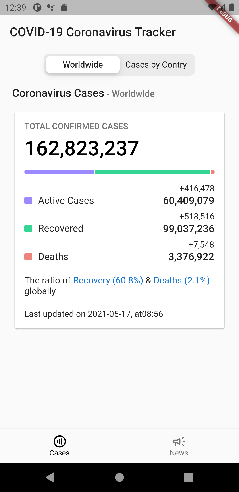
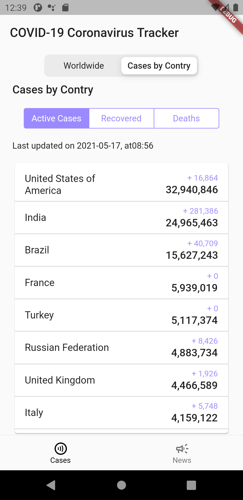
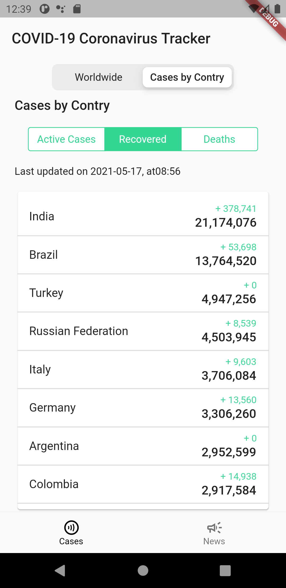
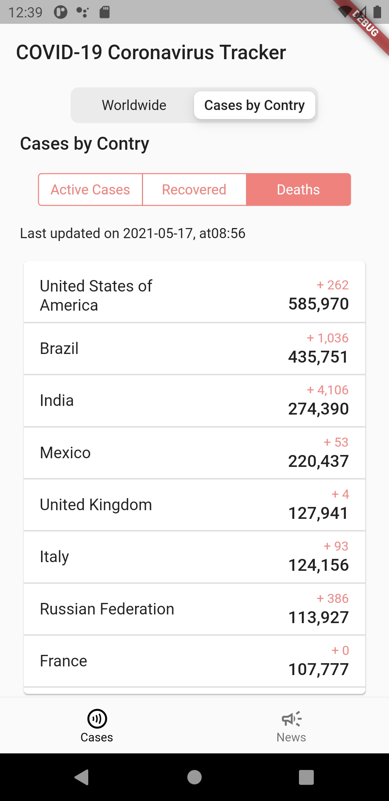
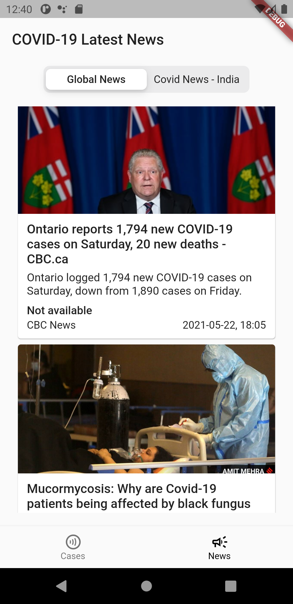
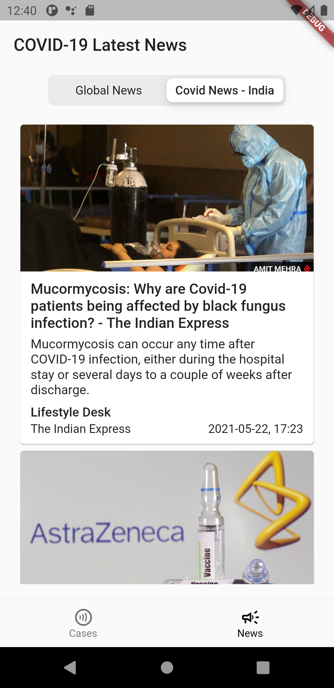
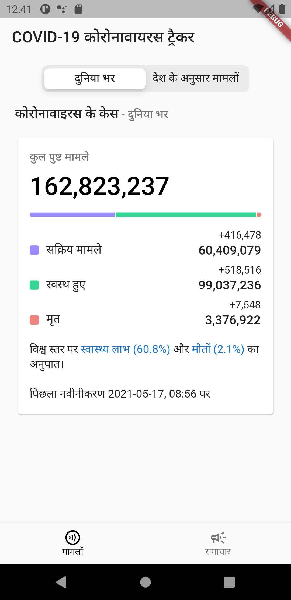
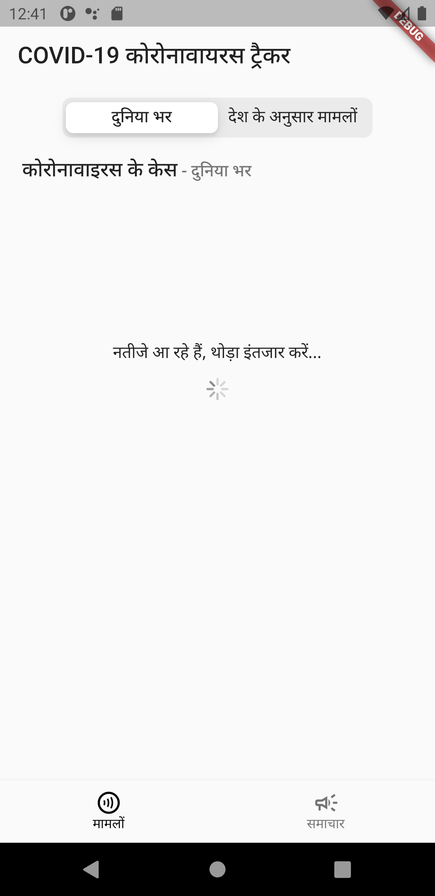

# Covid App

COVID-19 application made with Flutter, following Test Driven Development (TDD) and Clean Architecture.

## Features:

Ths project has several features:

- Fetch Covid cases and latest news related to COVID-19 from APIs.
- Test Driven Development (TDD).
- Follow ResoCoder's Clean Architecture. For details, click [here](https://resocoder.com/flutter-clean-architecture-tdd/).
- Internationalization with JSON for two locale values - `en` and `hi`.
- CI/CD pipeline with Github actions.

## Preview:

<div style="text-align: center"><table><tr>
<td style="text-align: center">

</td>
<td style="text-align: center">

</td>
<td style="text-align: center">

</td>
<td style="text-align: center">

</td>
</tr></table>
</div>
<div style="text-align: center"><table><tr>
<td style="text-align: center">

</td>
<td style="text-align: center">

</td>
<td style="text-align: center">

</td>
<td style="text-align: center">

</td>
</tr></table>
</div>

## APIs used

- Covid case data are taken from [here](https://api.covid19api.com/summary).
- News are fetched from [newsapi.org](https://newsapi.org/).

## Running the project

To run this project, some configuration steps are required.

- Create your own API key from [newsapi.org](https://newsapi.org/).
- Create a new file named `api_key.dart` inside the `lib` folder.
- Paste the following line with your API key.
```Dart
const String NEWS_API_KEY = 'YOUR_API_KEY';
```

Learn Test Driven Development and Clean Architecture

- [https://resocoder.com/flutter-clean-architecture-tdd](https://resocoder.com/flutter-clean-architecture-tdd/)

Additional good tutorials and documentations that might help

- Internationalizing Flutter apps: [https://flutter.dev/docs/development/accessibility-and-localization/internationalization](https://flutter.dev/docs/development/accessibility-and-localization/internationalization)
- CI & CD with Flutter: [https://flutter.dev/docs/deployment/cd](https://flutter.dev/docs/deployment/cd)
- Flutter GitHub Actions - Automate Your Workflow: [https://github.com/marketplace/actions/flutter-action](https://github.com/marketplace/actions/flutter-action)

## TODO

- [ ] Full test coverage including Integration Test
- [ ] Improve Documentation

## License

The project is released under the [MIT License](http://www.opensource.org/licenses/mit-license.php). The license can be found [here](LICENSE).

## Getting Started

For help getting started with Flutter, view our
[online documentation](https://flutter.dev/docs), which offers tutorials,
samples, guidance on mobile development, and a full API reference.

## If you like this repository then kindly give it a star ⭐
